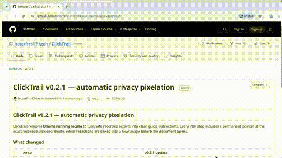

# ClickTrail ⚡

> **Record a browser action. Let local Ollama write the instruction. Export a visual PDF with an exact click pointer.**



ClickTrail is an **open-source, local-first Chrome extension** for turning browser workflows into polished visual PDF guides. It records a safe browser action, asks **Ollama running on your own computer** to write a clear instruction, and places a pointer precisely where the action happened.

| ⚡ Record | 🧠 Explain locally | 🎯 Point exactly | 📄 Deliver PDF |
| --- | --- | --- | --- |
| Capture a safe action in the active tab. | Ollama writes a concise step from allowed action context. | The guide marks the recorded click coordinate. | Print the finished visual guide to a single PDF. |

## ✨ What makes it different

ClickTrail does not send a workflow to a SaaS workspace or remote model. The extension communicates only with **Ollama at `127.0.0.1`** and requests a single local model, `gemma3:1b`. Screenshots stay in Chrome local storage; the model receives only the permitted description of an action, such as a page title, control label, and explicitly allowed short text.

> **The pointer is not guessed by AI.** ClickTrail uses the actual coordinate of the recorded action, so the resulting visual guide points to the right place even when a local model produces a short instruction.

## 🧭 Install ClickTrail

ClickTrail is distributed as an unpacked Chrome extension. Chrome cannot load a ZIP file directly: extract it first, then choose the extracted folder containing `manifest.json`.

| Step | What to do |
| --- | --- |
| **1. Download** | Download `clicktrail-chrome-extension-v0.2.1.zip` from the [Releases](../../releases) page. |
| **2. Extract** | Unzip it to a permanent folder, such as `Documents/ClickTrail`. |
| **3. Open Extensions** | Open `chrome://extensions` in Chrome or `edge://extensions` in Edge. |
| **4. Enable Developer mode** | Turn on **Developer mode** in the top-right corner. |
| **5. Load the folder** | Select **Load unpacked**, then choose the extracted folder that directly contains `manifest.json`. |
| **6. Pin ClickTrail** | Use Chrome’s puzzle icon and pin **ClickTrail** to the toolbar. |

> **Developer mode does not require a terminal or coding.** It is simply the Chrome setting that permits installing an unpacked extension.

> **Watch the verified path above.** The README demo begins on the public [v0.2.1 release](../../releases/tag/v0.2.1), selects the official ZIP, loads the extracted folder with Developer mode, records a real browser action, shows the exact-coordinate visual step, and opens the PDF output.

## 🧠 Required local Ollama setup

Ollama is **required**, not an optional cloud add-on. ClickTrail does not start a recording until the local Ollama service responds and the required `gemma3:1b` model is installed.

```bash
# Install Ollama from https://ollama.com, then download the local instruction model
ollama pull gemma3:1b
```

Ollama must also allow requests originating from a Chrome extension. On Linux systems using systemd, create a service override with the following environment variable, then restart Ollama:

```text
OLLAMA_ORIGINS=chrome-extension://*
```

For example, run `sudo systemctl edit ollama`, add the `Environment="OLLAMA_ORIGINS=chrome-extension://*"` line under `[Service]`, then run `sudo systemctl daemon-reload` and `sudo systemctl restart ollama`. On other operating systems, set the same environment variable before starting the Ollama service.

ClickTrail requests access only to `http://127.0.0.1:11434/*`; it has no cloud endpoint and no broad website host permission.

## 🎬 Create a visual guide

1. Open a normal HTTP or HTTPS website.
2. Open ClickTrail and choose the blue **Record** button.
3. Complete a short workflow. Each safe action becomes a local guide step.
4. Choose **Stop and review**, then open the guide editor.
5. Review the AI-written title, edit it if needed, and add a manual redaction to any area that should not be shared.
6. Choose **Export PDF** and use the browser’s **Save as PDF** destination.

ClickTrail intentionally has **one delivery path: PDF**. It no longer offers raw HTML or ZIP exports, preventing accidental hand-off of editable guide source data.

## 🔐 Privacy and safety boundaries

| ClickTrail does | ClickTrail never does |
| --- | --- |
| Keeps screenshots, guides, and redactions in Chrome local storage. | Upload screenshots, analytics, or workflow data to a cloud service. |
| Sends permitted action context to the local Ollama service at `127.0.0.1`. | Send screenshot pixels or page content to Ollama or any remote API. |
| Uses the exact recorded coordinate for the PDF arrow and marker. | Guess a pointer location from an unrelated page or silently continue on a different origin. |
| Pixelates detected private text and sensitive field regions directly into the exported image. | Preserve detected passwords, emails, phone numbers, card data, OTPs, tokens, or secrets in the PDF image. |
| Blocks browser pages, sign-in flows, payment, banking, wallet, and verification surfaces. | Capture sensitive form values or send them to Ollama. |

Recording is restricted to the origin where it started. A navigation to another origin immediately ends the session and clears the **REC** badge. Before a PDF is opened, ClickTrail detects visible sensitive inputs and explicit private text such as personal emails, phone numbers, credential-like tokens, and card-style values. Their regions are **pixelated into a fresh export image**, while any manual redactions remain permanently baked on top. The PDF does not retain an unredacted source screenshot or the automatic masking metadata.

> Automatic masking covers detected page text and form regions only. Always review the guide in the editor and use **Redact sensitive area** for anything private rendered in an image, canvas, video, or a non-standard interface.

## ✅ Real validation

The GIF above is based on a manual Chromium v0.2.1 validation in a clean profile. It begins at the public release, selects the published ZIP, extracts and loads the root folder in `chrome://extensions`, confirms local `gemma3:1b` availability, records a real action on the public ClickTrail repository, and opens the resulting visual guide with its exact recorded pointer. The guide then reaches the PDF-only output.

The validation also confirmed that detected visible private content is raster-pixelated before export; the source screenshot and automatic-mask metadata are not retained by the PDF export. You can inspect the earlier real one-page output at [Example Domain walkthrough PDF](assets/clicktrail-example-domain-real-guide.pdf). The automated suite contains **7 Vitest tests** covering guide safety, redactions, sensitive-content handling, and the local-Ollama fallback. Full technical notes are available in [TESTING.md](TESTING.md).

## ⚠️ Current limitations

ClickTrail works in Chrome and Chromium-based browsers such as Edge. It does not record browser-internal pages, native desktop applications, cross-device workflows, or video. It requires a computer capable of running Ollama locally; it does not provide a hosted fallback by design.

## 🤝 Contributing

Contributions and issue reports are welcome. Please preserve the core promise: **no cloud account, no remote AI API, no hidden tracking, and no unsafe capture of sensitive input.**

## 📜 License

ClickTrail is released under the [MIT License](LICENSE).
