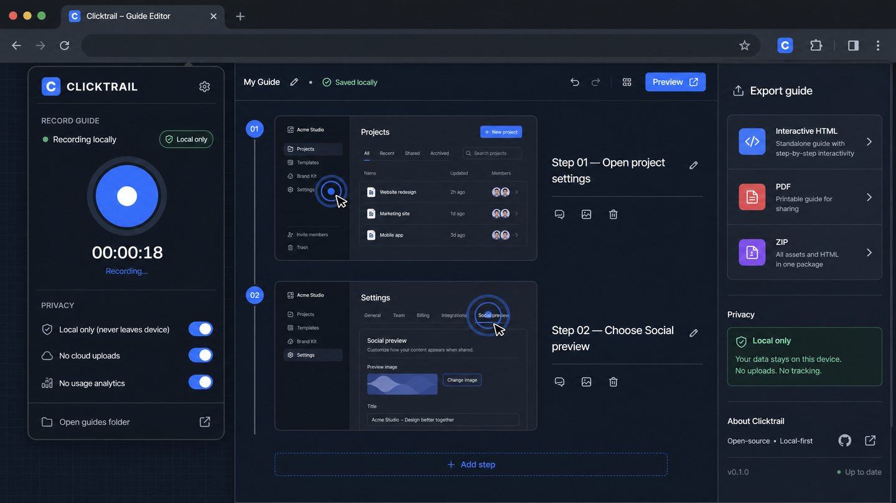

# Clicktrail ⚡

> **Record a browser workflow. Export a visual guide. Keep every screenshot on your device.**



Clicktrail is an **open-source, local-first Chrome extension** for turning browser clicks into client-ready visual guides. It captures steps while you work, lets you rename, reorder, redact, and export them, then creates a guide you can share without a hosted account or server.

| ⚡ Capture | ✍️ Refine | 🔒 Protect | 📤 Deliver |
| --- | --- | --- | --- |
| Record clicks in the active browser tab. | Edit every step and add useful notes. | Cover sensitive areas before exporting. | Export interactive HTML, a print-ready guide, or a ZIP package. |

## ✨ Why Clicktrail?

Most workflow-documentation tools put your screenshots in a workspace or cloud account. Clicktrail starts from a different principle:

> **Your guide stays on your device until you decide to export it.**

There is no Clicktrail account, remote database, telemetry dashboard, or hosted workspace. A guide lives in your Chrome local storage and can be deleted with one click.

## 🧭 Install from the ZIP — no server required

Clicktrail is distributed as a normal folder inside a ZIP archive. Chrome **cannot load the ZIP file itself**: first extract it, then load the extracted folder.

| Step | What to do |
| --- | --- |
| **1. Download** | Download `clicktrail-chrome-extension-v0.1.0.zip` from this repository’s **Releases** page. |
| **2. Extract** | Unzip it to a folder that you will not move or delete, such as `Documents/Clicktrail`. |
| **3. Open Extensions** | In Chrome or Edge, type `chrome://extensions` in the address bar. |
| **4. Enable Developer mode** | Turn on the **Developer mode** switch in the top-right corner. |
| **5. Load the folder** | Click **Load unpacked** and choose the extracted `clicktrail` folder — the one that contains `manifest.json`. |
| **6. Pin Clicktrail** | Use the extensions puzzle icon in Chrome, then pin Clicktrail to your toolbar. |

> **Tip:** “Developer mode” is a Chrome setting on the Extensions page. It does **not** mean that you need to open a terminal or write code.

## 🎬 Use Clicktrail

1. Open any regular website in Chrome or Edge.
2. Click the **Clicktrail** toolbar icon and select the blue record button.
3. Complete your workflow. Every click is recorded as a private guide step.
4. Choose **Stop and review**, then open the guide editor.
5. Rename a step, add a note, move steps, or select **Redact sensitive area** before you export.
6. Export a single interactive HTML file, print to PDF, or download a ZIP containing the guide and its source data.

## 🔐 Privacy by design

| Clicktrail does | Clicktrail does not do |
| --- | --- |
| Stores the active guide, screenshots, and redactions in Chrome local storage. | Create an account, send screenshots to a server, or use analytics. |
| Lets you redact a selected area before any export. | Capture Chrome internal pages such as `chrome://extensions`. |
| Keeps an export entirely on your computer until you choose to share it. | Offer multi-user cloud collaboration in the first version. |

Clicktrail asks for access to web pages so that it can observe clicks **only while you are recording**. The recorder ignores every page until you start it from the extension popup.

## 🧰 Build from source

```bash
pnpm install
pnpm check
pnpm test
pnpm package
```

The production extension folder is created in `dist/`. The ready-to-share archive is created at:

```text
release/clicktrail-chrome-extension-v0.1.0.zip
```

Load `dist/` with **Load unpacked** while developing.

## 🗂️ Project map

```text
src/
  background.ts       # local recording state and visible-tab screenshots
  content.ts          # click listener active only during a recording
  popup.ts             # compact recorder interface
  editor.ts            # guide editor, redaction, and export logic
  shared/              # guide model, local storage, export helpers
```

## ⚠️ Current limitations

Clicktrail is intentionally a first local-first release. It works in Chrome and Chromium-based browsers such as Edge. It does not record browser-internal pages, cross-device workflows, native desktop applications, or video. “PDF export” uses the browser print dialog, where you choose **Save as PDF**.

## 🤝 Contributing

Contributions and issue reports are welcome. Please keep the project’s core promise intact: **no forced cloud account, no background tracking, and no server required for the basic workflow**.

## 📜 License

Clicktrail is released under the [MIT License](LICENSE).
